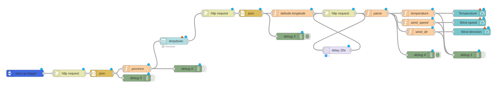
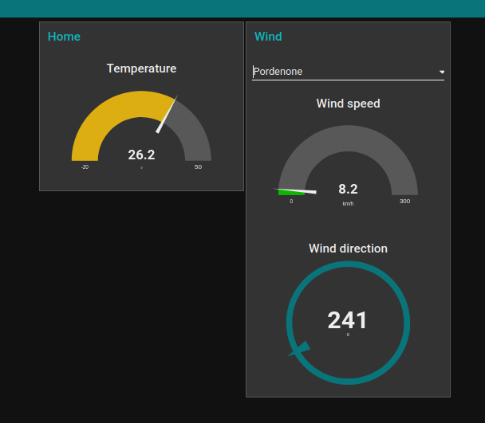
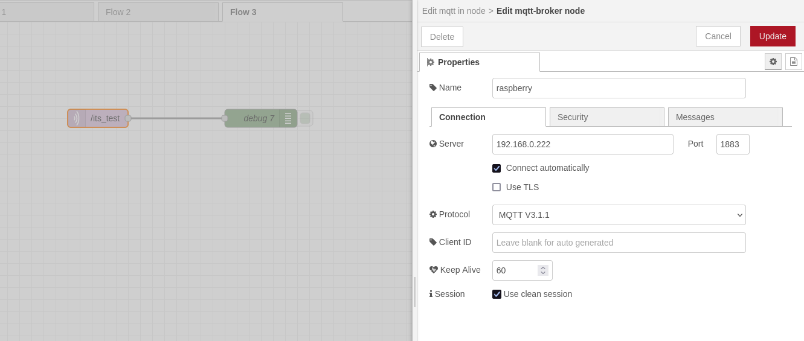

# Node-red

Node-RED è uno strumento nato con l’idea di gestire il mondo dell’ IoT tramite il paradigma dei flussi di dati, la sua base è JavaScript con Node.js 

Funziona tramite degli eventi.

## Installazione

Dare il seguente comando:

```bash
bash <(curl -sL https://raw.githubusercontent.com/node-red/linux-installers/master/deb/update-nodejs-and-nodered) --node18
```

## Avvio del servizio

Comodo usare screen (o tmux), così da creare delle sessioni di terminale virtuali, alle quali potersi agganciare o sganciare in qualsiasi momento:

```bash
screen -S node
node-red
^a+d
```

Quindi collegarsi al seguente indirizzo:

```bash
http://<hostname>:1880

# oppure

http://<ip>:1880

# per la dashboard grafica

http://<ip>:1880/ui
```
## Interfaccia Node-RED

Node-RED possiede un interfaccia web molto chiara, sulla sinistra si trovano i nodi disponibili suddivisi per categorie.

## Configurazione

Il file di configurazione si trova in `~/.node-red/`, dove si trovano anche i vari *flow.js*.

Nel file `~/.node-red/setting.js` decommentare le seguenti righe:

```bash
    /** To password protect the Node-RED editor and admin API, the following
     * property can be used. See http://nodered.org/docs/security.html for details.
     */
    adminAuth: {
       type: "credentials",
        users: [{
            username: "admin",
            password: "$2b$08$yQ.hN8lSlfJxu7tkEo/He.0PI5EmPL0mePfJcoV2FTEStnqtxr3ba",
            permissions: "*"
        }]
```

Il comando per generare la password cifrata da inserire nel precedente file:

```bash
node-red admin hash-pw
```
che viene utilizzato per generare una password crittografata.

## Moduli

Da Settings>Palette installare:

- node-red-node-serialport;
- node-red-contrib-startup-trigger;
- node-red-dashboard





# Mosquitto

Il protocollo MQTT (Message Queue Telemetry Transport) sostanzialmente si basa su un modello di brokering, vale a dire l’esistenza di un soggetto (il broker) al quale tutti i client 
si registrano e verso il quale quest’ultimi inoltrano e ricevono messaggi per e da altri client anch’essi connessi.

## Installazione

```bash
screen -S mosquitto
sudo apt install mosquitto mosquitto-clients -y
systemctl status mosquitto.service 
sudo vim /etc/mosquitto/mosquitto.conf 
```
Questo il file di configurazione finale di mosquitto:

```bash
# Place your local configuration in /etc/mosquitto/conf.d/
#
# A full description of the configuration file is at
# /usr/share/doc/mosquitto/examples/mosquitto.conf.example

pid_file /run/mosquitto/mosquitto.pid
persistence true
persistence_location /var/lib/mosquitto/
log_dest file /var/log/mosquitto/mosquitto.log
include_dir /etc/mosquitto/conf.d
per_listener_settings true
allow_anonymous false

```
Creare gli utenti che potranno connettersi al topic e la relativa password. Infine riavviare il servizio:

```bash
sudo mosquitto_passwd -c /etc/mosquitto/password_file mario
sudo mosquitto_passwd /etc/mosquitto/password_file luigi
sudo systemctl restart mosquitto.service 
^a+d
```
## Pubblicare un messaggio su un topic

```bash
mosquitto_pub -h 192.168.0.222 -m "test da Rasbian" -t /its_test -u mario -P password
```
dove:

- `-h`: questo parametro specifica l'indirizzo IP del broker MQTT a cui il messaggio deve essere inviato;
- `-m`: questo parametro specifica il testo del messaggio che deve essere pubblicato nel topic specificato;
- `-t`: questo parametro specifica il nome del topic al quale il messaggio deve essere pubblicato;
- `-u`: questo parametro specifica il nome utente necessario per autenticarsi presso il broker MQTT;
- `-P`: questo parametro specifica la password necessaria per autenticarsi presso il broker MQTT.

Per specificare la password da un file:

```bash
mosquitto_pub -h <host> -p <port> -t <topic> -u <username> -P file:<path_to_file>
```

## Ricevere un messaggio via seriale

Per ricevere un messaggio via seriale da parte del simulatore del PIC16F877A, installato su Windows, attraverso la porta COM7 (virtuale), seguire i seguenti passaggi.

Da Windows:

```bash
cd Documents/nodejs/its_iot_2023/serial_test/
touch index.js
npm init
npm view serialport versions
npm install serialport@9.2.8
npm install -g nodemon
npm install mqtt --save
```

Quindi editare il file `index.js`:

```js
const SerialPort = require('serialport')
const Readline = require('@serialport/parser-readline')
const port = new SerialPort('com7') // com0com di Windwos
const mqtt = require('mqtt')
const client = mqtt.connect('mqtt://192.168.0.222', { username: "mario", password: "password" }) 

const parser = port.pipe(new Readline({ delimiter: '\r\n' })) // Ogni riga deve terminare con questi due caratteri per essere correttamente interpretata
parser.on('data', parseMSg)

// passare i dati via mqtt, per poterli leggere tramite node-red
// trasformare il dato in json

client.on('connect', function () {
    console.log("connected")
})

function parseMSg(data) {
    let values = data.split('\n')
    console.log(values)
    let jsonOut = {
        "code": values[0],
        "rasp_id": values[1],
        "home_id": values[2]
    }
    let jsonStr = JSON.stringify(jsonOut)
    console.log(jsonStr)
    client.publish('/its_test', jsonStr)
}
```

Quindi avviare il programma tramite il comando:

```bash
nodemon index.js
```

Se il simulatore del PIC16F877A funziona correttamente e il programma invia dei dati via seriale, questi saranno correttamente ricevuti e inviati al broker mqtt.

### Visualizzare i messaggi da node-red

Inserire i due seguenti moduli:

`mqtt in`, avendo cura di inserire le relative credenziali e `debug`, affinché venga stampato il messaggio o il codice ricevuto sul topic.



## Collegamenti

- [https://nodered.org/docs/getting-started/raspberrypi](https://nodered.org/docs/getting-started/raspberrypi)
