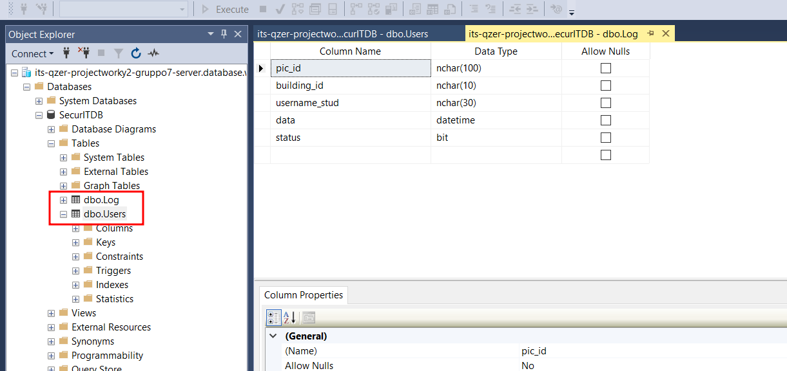

## Creare un database Azure SQL

[Guida Microsoft per la creazione di un DB su Azure](https://learn.microsoft.com/it-it/azure/azure-sql/database/single-database-create-quickstart?view=azuresql&tabs=azure-portal)

- Collegarsi al portale [https://portal.azure.com/#create/Microsoft.AzureSQL](https://portal.azure.com/#create/Microsoft.AzureSQL)
- Lasciare l'opzione Tipo di risorsa impostata su **Database singolo** e selezionare *Crea*
- Creare un nuovo **Resource group** dal nome *ITS-QZER-ProjectWorkY2-Gruppo7*
- Inserire il nome del database, nel nostro caso *SecurITDB*
- Quindi creare il server *its-qzer-projectworky2-gruppo7-server*
  + Località: West-Europe
  + Metodo di autenticazione: Usa autenticazione SQL
  + Account di accesso amministratore server: *securitadmin*
  + Password
- Lasciare l'opzione *Usare il pool elastico SQL?* impostata su No
- Selezionare Configura database
    + Utilizzo generico
    + Serverless
    + 3 GB per il DB sono sufficienti. Non serve che sia ridondante
    + Applica
- Passare allo step *Networking*
- Selezionare *Endpoint pubblico* in Metodo di connettività
- In regole Firewall
    + Add current client IP address: yes
- Passare allo step *Security*, lasciando tutto inalterato, quindi a *Additional settings*
- E' possibile creare un database di esempio
- Selezionare *Rivedi e crea*, quindi, dopo aver rivisto le impostazioni, *Crea*
- Il database verrà ora creato
- La risorsa è accessibile qui: [SecurIT](https://portal.azure.com/#@tecnicosuperiorekennedy.it/resource/subscriptions/55a9de92-ecad-42a7-9158-e95e8fe213ee/resourceGroups/ITS-QZER-ProjectWorkY2-Gruppo7/providers/Microsoft.Sql/servers/its-qzer-projectworky2-gruppo7-server/databases/SecurITDB/overview)

## Connettersi a un database SQL di Azure tramite SQL Server Management Studio

[Guida Microsoft per la connessione tramite SSMS](https://learn.microsoft.com/it-it/azure/azure-sql/database/connect-query-ssms?view=azuresql)

- Nella panoramica della risorsa, copiare il nome del server
```txt
its-qzer-projectworky2-gruppo7-server.database.windows.net
```
- Aprire SSMS
- Nella finestra di dialogo, immettere le seguenti informazioni per connettersi al database precedentemente creato:

|Impostazione|Valore|
|---|---|
|Server type|Database Engine|
|Server name|its-qzer-projectworky2-gruppo7-server.database.windows.net|
|Authentication|SQL Authentication|
|Login|securitadmin|
|Password|**********|

- Cliccare su *Connect* ed accedere al database

Per connettersi tramite **VSCode** seguire [questa guida](https://learn.microsoft.com/it-it/azure/azure-sql/database/connect-query-vscode?view=azuresql)

## Creare e aggiornare le tabelle del database

[Guida Microsoft per la creazione di tabelle tramite SSMS](https://learn.microsoft.com/it-it/sql/ssms/visual-db-tools/design-tables-visual-database-tools?view=sql-server-ver16)

- Fare clic con il pulsante destro del mouse sul nodo Tabelle nel database e quindi scegliere `Nuovo>Tabella`
- Una volta create le tabelle, per aggiornarle fare clic con il pulsante destro del mouse sulla tabella disponibile nel nodo Tabelle del database e quindi scegliere Design



## Progettazione del Database

## Connessione ad Database da Visual Studio


